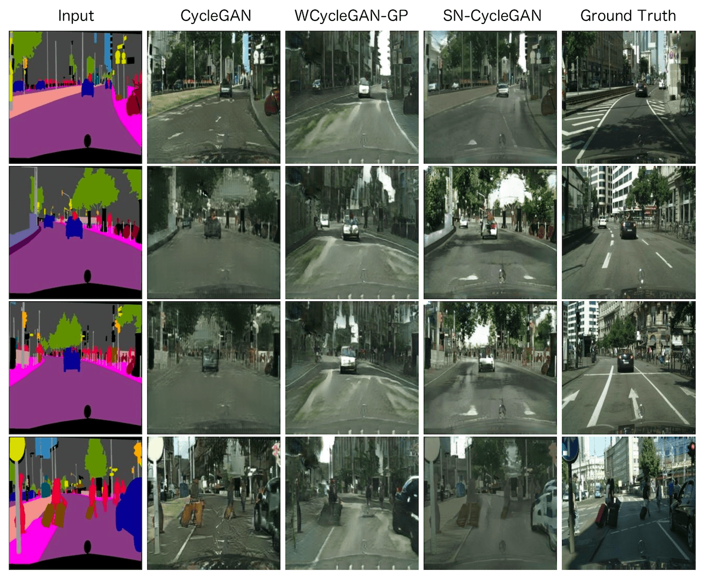
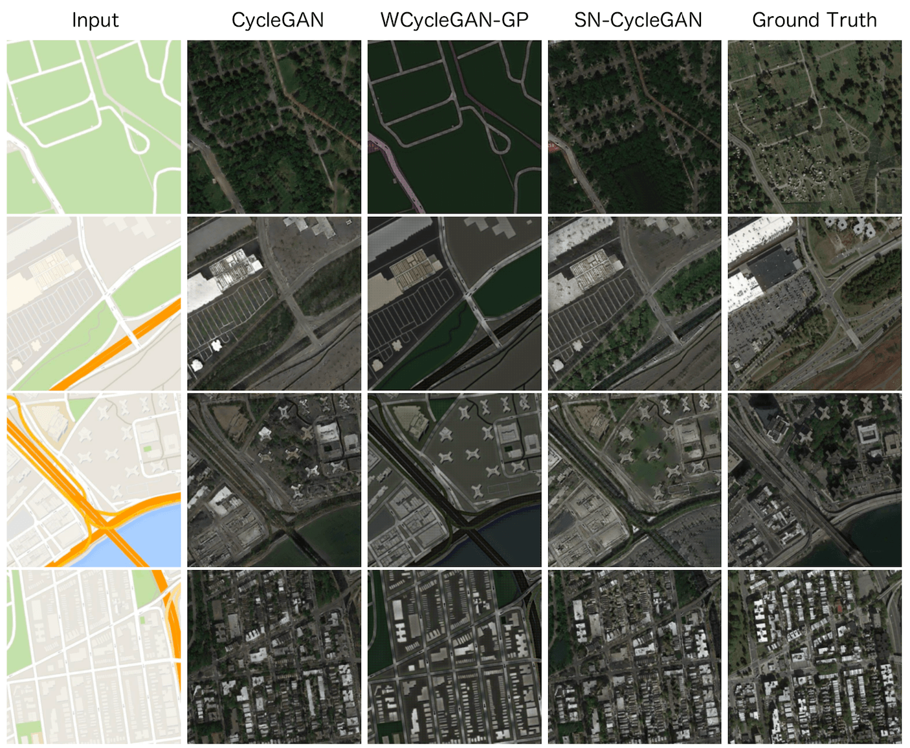
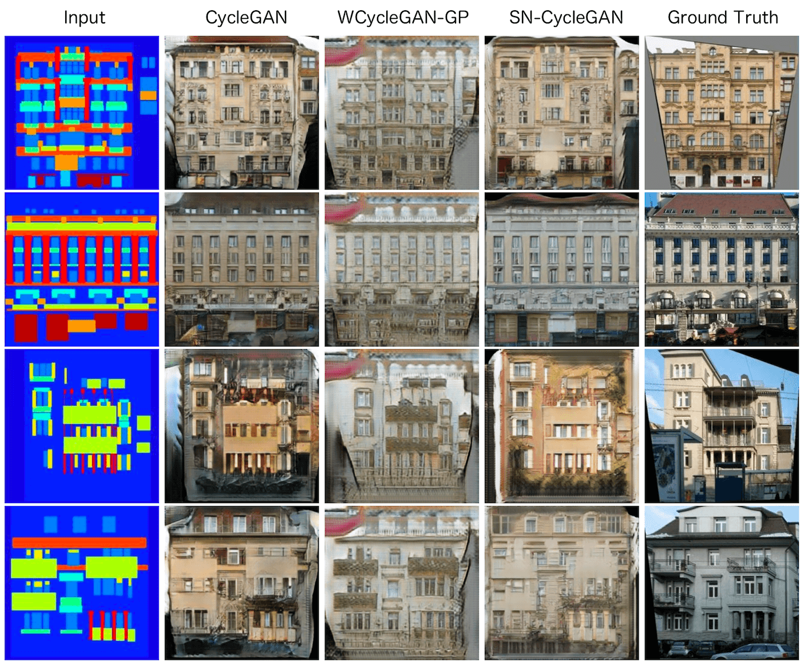

# Applying Spectral Normalization and Wasserstein loss with Gradient penalty to the Cycle Gan

CycleGAN with Spectral Normalization on the discriminator weights

### Information

--- The code will be provided soon ---

This project was realiazed for the Object Recognition and Computer Vision course that we had in M.Sc. MVA (ENS Paris-Saclay).

I worked with Jean-Baptiste Sevestre. Link of his GitHub https://github.com/jbsevestre

The obtained results and the details about the implemention are shown in report.pdf, in the report file.
The report was limited to 3 pages (+images).

Note that we also compared the SN-CycleGAN to another method that stabilized the training of GANs ; the WGAN-GP

Our code is based on the original CycleGAN implementation in Pytorch that you can find here https://github.com/junyanz/pytorch-CycleGAN-and-pix2pix

We have also used the code for Spectral Normalization from : https://github.com/christiancosgrove/pytorch-spectral-normalization-gan

## Results

Images come from the "labels→photo" generator for different methods on :

* Cityscapes dataset

* data scraped from Google Maps

* CMP Facaces

